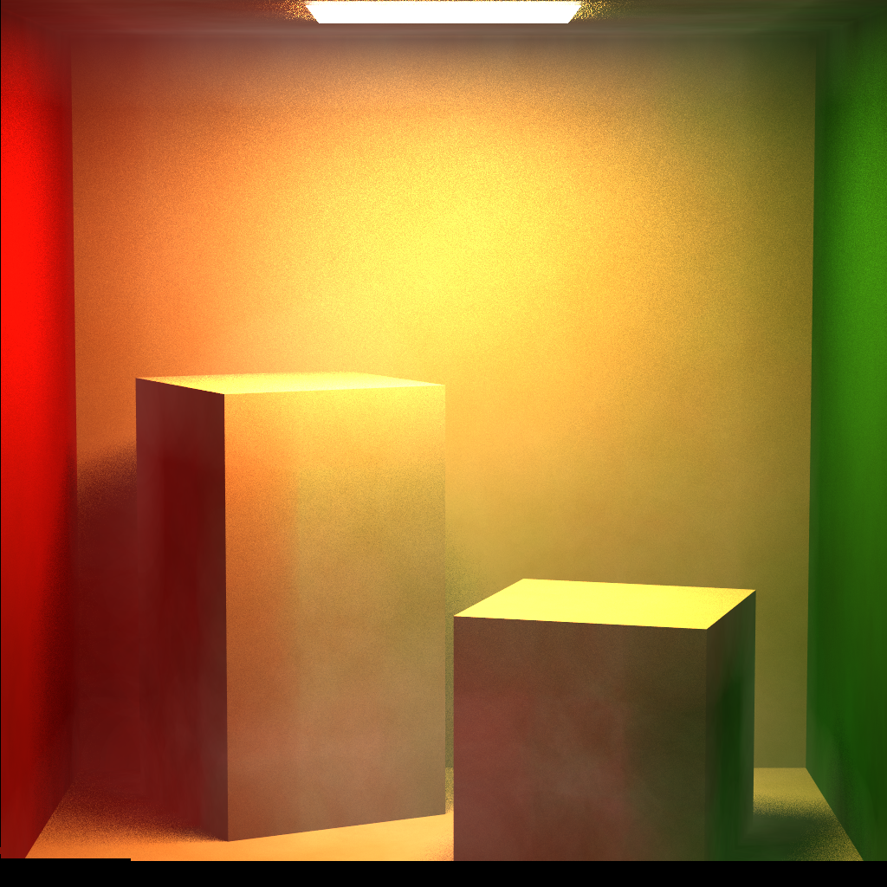

Monte Carlo Path Tracer
======================

**University of Pennsylvania, CIS 561: Advanced Computer Graphics, Semester Project**

Name: Meghana Seshadri 

 

## Project Overview 

This path tracer was implemented on a weekly basis as part of a course semester project over the course of 8 weeks. Path tracers implement a realistic lighting algorithm that simulates light bouncing in a scene. Monte Carlo is an integration method that is used to simulate global illumination.

In a scene, with a light source(s) and objects, direct illumination is when light emitted from light sources bounce off of surfaces of objects once before reaching the eye. Global illumination is essentially indirect illumination, where light rays can bounce off a surface multiple times before reaching the eye. Calculating all possible light paths within a scene is a difficult task, which is why Monte Carlo integration is used to effectively estimate all the light coming from all possible directions. It's a statistical method that approximates how much light is redirected towards a point P by other objects in a scene, by casting rays from point P in random directions and evaluating their contributions. 

[Click here for more info on path tracing and monte carlo estimation](https://www.scratchapixel.com/lessons/3d-basic-rendering/global-illumination-path-tracing)

### Operating Instructions

- Download the code, open in QT Creator, build, and run. A GUI should appear like the one below:

 

Functionality includes the following: 
- `File -> Load Scene`: This will open a file browser where you can locate the .json scene file that you wish to render. Look at the scene_files folder for example scene files. 
- `File -> Render Scene`: This will render the scene displayed in the viewer according to all the settings on the GUI.
- `Samples Count`: This is the square root of the samples you wish to render. So putting in "10" will be 100 samples.
- `Recursion Limit`: This sets the depth level for number of bounces per ray
- `Progressive Preview`: Having this checked will show the image as it gets rendered in the viewer
- `Integrator type`: This drop down chooses which integrator to run with
- `Max Primitives In Node`: This controls how many primitives to have in a node during BVH construction
- `Make BVH`: Toggle this to utilize BVH tree construction

*Note: Please turn OFF BVH tree construction in the GUI prior to rendering with Photon Mapping.*

### Weekly Breakdowns
Take a look below the `Render` section for a weekly implementation breakdown and more information on the various features.

### Features

The following features were implemented:
- 
- 

## Renders 
1. M 

100 per pixel
Recursion depth: 5
512x512 pixels
Render time: 4 hours
Photon mapping (25000 photons)

 

2. Cornell Box 

64 samples per pixel
Recursion depth: 5
1024x1024 pixels
Render time: 3 hours
Photon Mapping (25000 photons)

 

3. Cornell Box 2 Lights

25 samples per pixel
Recursion depth: 5
512x512 pixels
Render time: 1 hour
Photon mapping (100000 photons)

 

## Weekly Breakdowns

### Week 1: Sampling 

Implemented functions in order to generate sample points on the surfaces of objects. Sampling the surfaces of different shapes is very important in a path tracer, some of the reasons being:

- To cast rays in random directions within a hemisphere
- To sample rays to area lights by sampling points on the surfaces of these lights

### Week 2: Naive Path Tracing 

Implemented functions to generate random ray samples within a hemisphere to compute the lighting a surface intersection receives. Since this is a naive implementation, the images produced will be rather grainy in appearance, but ray sampling functions implemented in future weeks combated this. 

The Light Transport Equation
--------------
#### Lo(p, &#969;o) = Le(p, &#969;o) + &#8747;S f(p, &#969;o, &#969;i) Li(p, &#969;i) V(p', p) |dot(&#969;i, N)| _d_&#969;i

* __Lo__ is the light that exits point _p_ along ray &#969;o.
* __Le__ is the light inherently emitted by the surface at point _p_
along ray &#969;o.
* __&#8747;S__ is the integral over the sphere of ray
directions from which light can reach point _p_. &#969;o and
&#969;i are within this domain. In general, we tend to only care
about one half of this sphere, determining the relevant half based on the
reflectance or transmittance of the BSDF.
* __f__ is the Bidirectional Scattering Distribution Function of the material at
point _p_, which evaluates the proportion of energy received from
&#969;i at point _p_ that is reflected along &#969;o.
* __Li__ is the light energy that reaches point _p_ from the ray
&#969;i. This is the recursive term of the LTE.
* __V__ is a simple visibility test that determines if the surface point _p_' from
which &#969;i originates is visible to _p_. It returns 1 if there is
no obstruction, and 0 is there is something between _p_ and _p_'. This is really
only included in the LTE when one generates &#969;i by randomly
choosing a point of origin in the scene rather than generating a ray and finding
its intersection with the scene.
* The __absolute-value dot product__ term accounts for Lambert's Law of Cosines.

### Week 3: Direct Lighting 

Implemented:

- A new Integrator class to estimate the direct lighting in a scene by sampling points on light surfaces
- A collection of BxDFs to handle specular reflective and transmissive materials

### Week 4: Full Lighting Integrator 

Implemented:

- A new Integrator class that combines the sampling techniques of the NaiveIntegrator and DirectLightingIntegrator classes
- A set of BxDF classes used to represent glossy surfaces using microfacet distribution models

### Week 5: Global Illumination 

This week I rewrote FullLightingIntegrator::Li so that it incorporated global illumination. This entailed changing the function to be an interative implementation versus a recursive one in order to more easily track certain pieces of information, such as the cumulative throughput of ray paths and whether or not the ray just bounced off a specular surface. The throughput determines when the ray path terminates via the Russian Roulette heuristic. 

**Computing the direct lighting component**

Using almost the same code as you wrote for the previous assignment, use multiple importance sampling to evaluate the direct lighting your ray intersection receives from a randomly chosen light source. This value will be one term; if your BSDF-generated ray does not hit the light source you randomly chose, then its contribution will be black. This term should NOT include any global illumination light, or any light from any other light source. As in your DirectLightingIntegrator, make sure to scale the direct lighting contribution by the number of light sources in your scene; since you are sampling each light source at a frequency inversely proportional to the number of lights in the scene, you must scale each light's contribution upward to counteract its otherwise lessened contribution.

Similarly to your DirectLightingIntegrator, we are going to treat the direct lighting contribution of specular surfaces as black. While the term we'd obtain from the BSDF-based sample would not actually be black, we perform a slightly less costly BSDF contribution computation below, so we're just going to ignore the direct lighting term entirely when it comes to specular materials.

**Computing the ray bounce and global illumination**

Separately from your direct lighting term, you should use an entirely new 2D uniform random variable to generate a new BSDF-based ωi using Sample_f. You will multiply the color obtained from Sample_f with your ray throughput, along with the absolute-dot-product term and the 1/pdf term. This effectively compounds the inherent material colors of all surfaces this ray has bounced from so far, so that when we incorporate the lighting this particular ray bounce receives directly, it is attenuated by all of the surfaces our ray has previously hit. To this end, once you have your updated throughput, multiply it with the direct lighting term from above and add the result to your accumulated ray color. Finally, make sure to update the ray that your while loop is using to originate from your current intersection and travel in the direction of the ωi that you just computed.

**Correctly accounting for direct lighting**

Since your path tracer computes the direct lighting a given intersection receives as its own term, your path tracer must not include too much light. This means that every ray which already computed the direct lighting term should not incorporate the Le term of the light transport equation into its light contribution. In other words, unless a particular ray came directly from the camera or from a perfectly specular surface, Le should be ignored.

**Russian Roulette Ray Termination**

After you compute the direct lighting and indirect lighting terms, compare the maximum RGB component of your throughput to a uniform random number and stop your while loop if said component is smaller than the random number. Most importantly, to keep your path tracer mathematically correct, you must then divide your throughput by the maximum component of your throughput; this scales up the contribution of this ray path proportionally to how likely the path is to terminate so that we are still accounting for the contribution that paths that were terminated earlier would have had.

### Week 6: Acceleration Structures 

**Overview**

Thus far, we have been rendering scenes with relatively little geometry. However, if we want to be able to produce more interesting images, we'll need to be able to render scenes with large numbers of polygons, e.g. triangle meshes, without taking forever. To that end, we will implement a Bounding Volume Hierarchy to contain all Primitives in the scene so that we can perform ray-object intersection more efficiently.

**General Requirements**

For this assignment, all we ask is that you implement a BVH acceleration structure. Whether or not you use PBRT's full implementation is up to you, but we encourage you to design the BVH your own way. PBRT's structure is highly optimized, and their code is particularly opaque and difficult to debug, and you will benefit more as a coder if you try to translate the BVH concept into code. All we ask is that your program and BVH fulfill the requirements below.

**Bounds3f class functions**

We have provided you a 3D axis-aligned bounding box class Bounds3f in scene/bounds.h. Please implement the three functions that have been declared at the bottom of the class: Apply, SurfaceArea, and Intersect.

Apply should transform the eight corners of the bounding box by the input Transform's matrix, then compute a new axis-aligned bounding box that encompasses these corners (which may no longer be axis aligned, especially if the Transform contained a rotation). This function sets the invoking Bounds3f to be this bounding box, and returns the resultant bounds.
SurfaceArea, as its name implies, computes and returns the surface area of the invoking Bounds3f. This will be used when you apply the surface area heuristic to choose a place at which to split yourBVH.
Intersect computes the intersection of the input ray with this bounding box. Unlike the Intersect functions of the Shape classes, this does not output an entire Intersection data package, but just outputs the t parameterization that the intersection would have with the ray. This is useful for determining which bounding box is intersected first by a given ray. Additionally, negative t values are valid if and only if the ray's origin lies within the bounding box.
In addition to these functions, we have already provided you with a few utility functions that you may or may not use, such as MaximumExtent, which returns the index of the axis along which the bounding box has the largest side length, or Union, which creates a Bounds3f that encompasses all inputs.

**Shape class WorldBound functions**

We have updated the Shape class to include a WorldBound function, which computes the axis-aligned bounding box of the shape after it has been transformed into world space. Please implement this function for each of the classes which inherit from the Shape class. You will find Bounds3f's Apply function useful when implementing all of the various Shapes' WorldBound functions. You will need to compute the world-space bounding boxes of all your scenes' Primitives in order to construct your BVH.

**BVHAccel class**

We have provided you with a class that represents a bounding volume hierarchy, BVHAccel. Most of the details of implementation are left for you to decide, but you will need to implement at least two of the functions we have provided: BVHAccel's constructor, and its Intersect function. The constructor is where you should build the hierarchy of bounding box nodes; the only detail we require of this construction is that you use the Surface Area Heuristic to determine where to split your geometry. We have provided you with the intermediate structs that PBRT uses in its implementation of its BVH, but we do not require you to use any of them.

A branch of BVH construction should produce a leaf node when there would be at most maxPrimsInNode Primitives within that node, or when the cost of subdividing that node via the surface area heuristic would be greater than the cost of simply testing for intersection against all primitives in that node. Remember that the SAH cost of a subdivision is estimated as (surface area of left box * number of primitives in left box + surface area of right box * number of primitives in right box ) / (surface area of encompassing box). Likewise the cost of intersecting a node is simply number of primitives in the node.

Timing your BVH's construction

Use a QTime to measure how many milliseconds it takes your BVH to be constructed. QTime::start() sets the QTime's internal time counter to the present time, and QTime::elapsed() returns how many milliseconds have gone by since start() was invoked. Your program should print this time via cout, and there should be some sort of print message labeling this number as the build time of the BVH.

----------------------------------------------------------------------------------------------------------------

### Week 7: Thin Lens Camera + Extra Light Sources

Overview

As the semester draws to its close, we embark on the final additions to your path tracers. The first component of the final project will be to implement at least one of the "basic" features listed in the writeup below, along with a lens-based camera model capable of producing depth of field. We will not provide any base code for this assignment; it is up to you to create any classes you will need to complete your feature(s). These features will be due a week into the final project, but don't let that stop you from working on the larger features due at the end of the semester!

Lens-based camera

Implement the thin-lens camera model as described in chapter 6.2.3 of PBRT. You may wish to make this class inherit from the base Camera class we have provided. You will also have to alter the Scene class to include an instance of this new camera type. Render at least one scene with this new camera in order to exhibit its depth-of-field effect.

Other light sources

Implement at least two of the light sources described in Chapter 12 of PBRT, aside from DiffuseAreaLight, which has already been provided to you. If you choose to implement additional light types, each one will be worth 10 extra credit points.

----------------------------------------------------------------------------------------------------------------

### Week 8: Photon Mapper

Implement a basic photon mapper that stores a set of global illumination photons and a set of caustic photons. 

Rather than storing a set of direct lighting photons, your renderer will simply evaluate the direct lighting at a
point using multiple importance sampling as in your path tracer. 

If you wish, you may try to make your renderer more efficient by also including a radiance
photon map, which stores the average of a set of surrounding photons. 

Finally, you will have to incorporate a volumetric data structure (e.g. a voxel grid or
kd-tree) in order to better store your photons and evaluate where they land.

----------------------------------------------------------------------------------------------------------------

