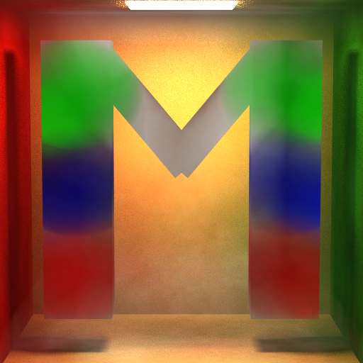
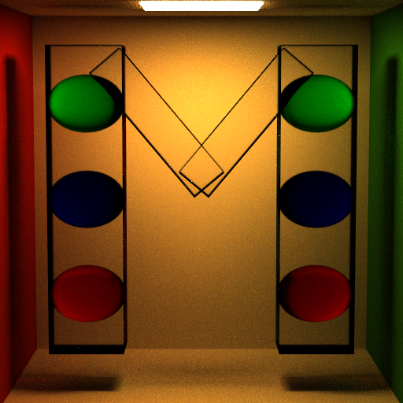
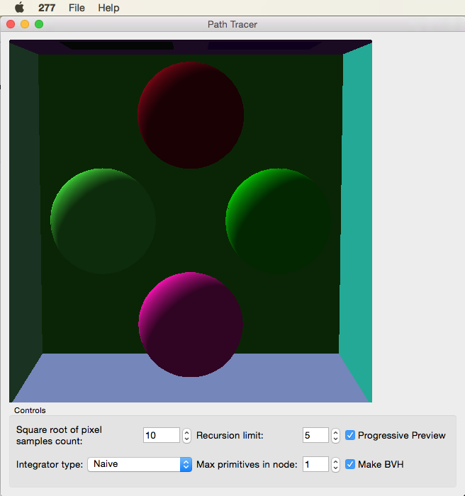
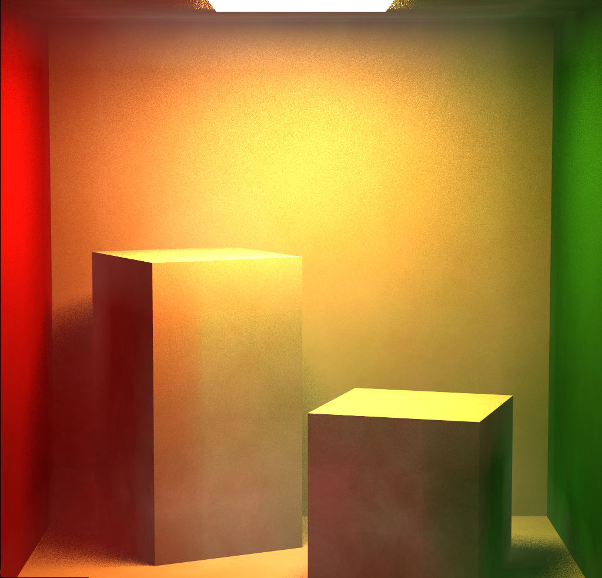
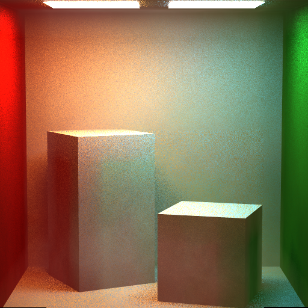

Monte Carlo Path Tracer
======================

**University of Pennsylvania, CIS 561: Advanced Computer Graphics, Semester Project**

Name: Meghana Seshadri 

Below are the same scene files, one rendered using Photon Mapping, the other with the Full Lighting Integrator

 
###### 512x512 pixels, 100 samples per pixel, Recursion depth: 5, Render time: 4 hours Photon mapping (25000 photons), "M" made with microfacet materials

 
###### 512x512 pixels, 100 samples per pixel Recursion depth: 5, Render: Full Lighting Integrator, "M" made with microfacet materials

## Project Overview 

This path tracer was implemented on a weekly basis as part of a course semester project over the course of 8 weeks. Path tracers implement a realistic lighting algorithm that simulates light bouncing in a scene. Monte Carlo is an integration method that is used to simulate global illumination.

In a scene, with a light source(s) and objects, direct illumination is when light emitted from light sources bounce off of surfaces of objects once before reaching the eye. Global illumination is essentially indirect illumination, where light rays can bounce off a surface multiple times before reaching the eye. Calculating all possible light paths within a scene is a difficult task, which is why Monte Carlo integration is used to effectively estimate all the light coming from all possible directions. It's a statistical method that approximates how much light is redirected towards a point P by other objects in a scene, by casting rays from point P in random directions and evaluating their contributions. 

[Click here for more info on path tracing and monte carlo estimation](https://www.scratchapixel.com/lessons/3d-basic-rendering/global-illumination-path-tracing)

### Operating Instructions

Download the code, open the .pro file (under assignment_package) in QT Creator, build, and run. A GUI should appear like the one below:

 

GUI functionality includes the following: 
- `File -> Load Scene`: This will open a file browser where you can locate the .json scene file that you wish to render. Look at the scene_files folder for example scene files. 
- `File -> Render Scene`: This will render the scene displayed in the viewer according to all the settings on the GUI.
- `Samples Count`: This is the square root of the samples you wish to render. So putting in "10" will be 100 samples.
- `Recursion Limit`: This sets the depth level for number of bounces per ray
- `Progressive Preview`: Having this checked will show the image as it gets rendered in the viewer
- `Integrator type`: This drop down chooses which integrator to run with
- `Max Primitives In Node`: This controls how many primitives to have in a node during BVH construction
- `Make BVH`: Toggle this to utilize BVH tree construction

*Note: Please turn OFF BVH tree construction in the GUI prior to rendering with Photon Mapping.*

### Weekly Breakdowns
Take a look below the `Render` section for a weekly implementation breakdown and more information on the various features.

### Features

The following features were implemented:
- Multiple light importance sampling 
- Naive and direct lighting integrators 
- Bounding Volume Hierarchy acceleration structure
- Photon Mapping 
- Microfacet distribution models 
- Lights: diffuse area light, point lights, distant lights, spot lights 
- Thin Lens Camera
- and more!

## Renders [More to come soon!]
1. M 

100 per pixel
Recursion depth: 5
512x512 pixels
Render time: 4 hours
Photon mapping (25000 photons)

 

2. Cornell Box 

64 samples per pixel
Recursion depth: 5
1024x1024 pixels
Render time: 3 hours
Photon Mapping (25000 photons)

 

3. Cornell Box 2 Lights

25 samples per pixel
Recursion depth: 5
512x512 pixels
Render time: 1 hour
Photon mapping (100000 photons)

 

## Weekly Breakdowns

### Week 1: Sampling 

Implemented functions in order to generate sample points on the surfaces of objects. Sampling the surfaces of different shapes is very important in a path tracer, some of the reasons being:

- To cast rays in random directions within a hemisphere
- To sample rays to area lights by sampling points on the surfaces of these lights

----------------------------------------------------------------------------------------------------------------

### Week 2: Naive Path Tracing 

Implemented functions to generate random ray samples within a hemisphere to compute the lighting a surface intersection receives. Since this is a naive implementation, the images produced will be rather grainy in appearance, but ray sampling functions implemented in future weeks combated this. 

#### The Light Transport Equation

#### Lo(p, &#969;o) = Le(p, &#969;o) + &#8747;S f(p, &#969;o, &#969;i) Li(p, &#969;i) V(p', p) |dot(&#969;i, N)| _d_&#969;i

* __Lo__ is the light that exits point _p_ along ray &#969;o.
* __Le__ is the light inherently emitted by the surface at point _p_
along ray &#969;o.
* __&#8747;S__ is the integral over the sphere of ray
directions from which light can reach point _p_. &#969;o and
&#969;i are within this domain. In general, we tend to only care
about one half of this sphere, determining the relevant half based on the
reflectance or transmittance of the BSDF.
* __f__ is the Bidirectional Scattering Distribution Function of the material at
point _p_, which evaluates the proportion of energy received from
&#969;i at point _p_ that is reflected along &#969;o.
* __Li__ is the light energy that reaches point _p_ from the ray
&#969;i. This is the recursive term of the LTE.
* __V__ is a simple visibility test that determines if the surface point _p_' from
which &#969;i originates is visible to _p_. It returns 1 if there is
no obstruction, and 0 is there is something between _p_ and _p_'. This is really
only included in the LTE when one generates &#969;i by randomly
choosing a point of origin in the scene rather than generating a ray and finding
its intersection with the scene.
* The __absolute-value dot product__ term accounts for Lambert's Law of Cosines.

----------------------------------------------------------------------------------------------------------------

### Week 3: Direct Lighting 

Implemented:

- A new Integrator class to estimate the direct lighting in a scene by sampling points on light surfaces
- A collection of BxDFs to handle specular reflective and transmissive materials

----------------------------------------------------------------------------------------------------------------

### Week 4: Full Lighting Integrator 

Implemented:

- A new Integrator class that combines the sampling techniques of the NaiveIntegrator and DirectLightingIntegrator classes
- A set of BxDF classes used to represent glossy surfaces using microfacet distribution models

----------------------------------------------------------------------------------------------------------------

### Week 5: Global Illumination

This week I rewrote FullLightingIntegrator::Li so that it incorporated global illumination. 

This entailed changing the function to be an interative implementation versus a recursive one in order to more easily track certain pieces of information, such as the cumulative throughput of ray paths and whether or not the ray just bounced off a specular surface. The throughput determines when the ray path terminates via the Russian Roulette heuristic. 

----------------------------------------------------------------------------------------------------------------

### Week 6: Acceleration Structures

Implemented 

- A Bounding Volume Hierarchy (BVH) acceleration structure to contain all Primitives in the scene so that we can perform ray-object intersection more efficiently

----------------------------------------------------------------------------------------------------------------

### Week 7: Thin Lens Camera + Extra Light Sources

Implemented:

- A thin lens-based camera model capable of producing depth of field
- More light sources including: distant light, point light, spot light

----------------------------------------------------------------------------------------------------------------

### Week 8: Photon Mapper

Implemented a basic photon mapper that stores a set of global illumination photons and a set of caustic photons in a voxel grid.

Rather than storing a set of direct lighting photons, the renderer evaluates the direct lighting at a
point using multiple importance sampling. 

----------------------------------------------------------------------------------------------------------------

